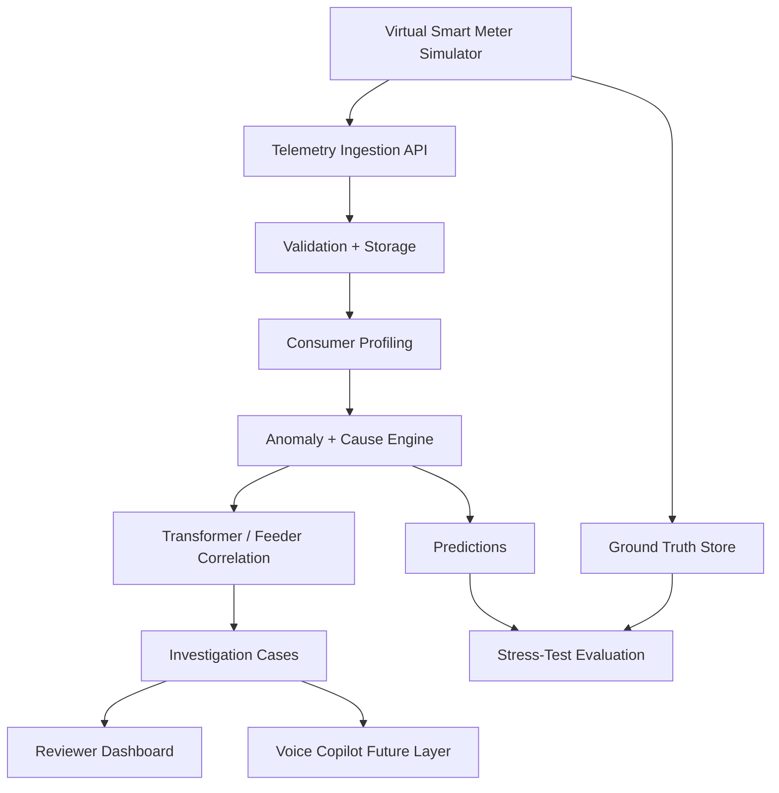

# Simulator-First Electron Prototype Plan

## Summary

Electron should be built as a software-first hackathon prototype with no physical hardware dependency. The Virtual Smart Meter Simulator becomes the primary data source and should mimic how hardware would behave: generating voltage, current, power, energy, meter status, communication status, and scenario ground truth. MQTT/ESP32/ThingsBoard remain optional future adapters, not part of the core prototype.

## Key Implementation Changes

- Make the simulator the official replacement for hardware in the prototype.
  - It should generate continuous smart-meter readings for multiple consumers.
  - It should support normal, theft/tampering, meter malfunction, communication failure, seasonal variation, legitimate abnormal consumption, and coordinated theft scenarios.
  - It should emit data in the same shape that future hardware would send.

- Use a single ingestion contract for all sources.
  - Source types: `SIMULATOR`, `CSV_UPLOAD`, `MQTT_DEVICE_FUTURE`.
  - The backend should not care whether telemetry came from simulated meters or future physical meters.
  - Hardware-specific implementation is out of scope for the prototype.

- Build a convincing real-time demo without hardware.
  - Simulator streams readings into backend.
  - Backend validates and stores readings.
  - ML/rule pipeline computes baselines, anomalies, probable cause, risk, and evidence.
  - Dashboard updates through WebSocket or polling.
  - Digital Twin UI visually shows grid state changes.

## Prototype Architecture

## Simulator Requirements

- Generate grid topology: feeders, transformers, consumers, peer groups.
- Generate consumer profiles: category, sanctioned load, tariff, baseline behavior, daily and weekly usage pattern.
- Generate telemetry: timestamp, voltage, current, power, energy, meter status, communication status.
- Generate scenario truth: affected consumers, scenario type, severity, start time, end time, expected cause.

## Scenario Behavior

- `NORMAL`: stable readings with realistic variation.
- `THEFT_TAMPERING`: sustained consumption drop while communication and meter health appear normal.
- `METER_MALFUNCTION`: abnormal zero, stuck, noisy, or impossible readings with meter-health issues.
- `COMMUNICATION_FAILURE`: missing or delayed readings with degraded/disconnected communication status.
- `SEASONAL_VARIATION`: broad legitimate change across similar consumers.
- `LEGITIMATE_ABNORMAL_CONSUMPTION`: one consumer changes behavior without transformer loss correlation.
- `COORDINATED_THEFT`: multiple consumers on one transformer show suspicious drops and transformer unexplained loss rises.

## Backend/API Adjustments

- Add simulator-focused endpoints:
  - `POST /simulation/scenario`
  - `POST /simulation/run`
  - `POST /simulation/stop`
  - `GET /simulation/status`
  - `GET /simulation/results/{run_id}`

- Add ingestion endpoint:
  - `POST /telemetry/readings`

- Keep future MQTT documented only:
  - no live MQTT setup required
  - no ESP32 code required
  - no ThingsBoard dependency required

## Frontend Adjustments

- Prioritize these pages for the prototype:
  - `/simulation`: scenario controls and grid visualization
  - `/dashboard`: live anomaly and grid summary
  - `/consumers/[id]`: baseline, peer comparison, and evidence
  - `/investigations/[id]`: field investigation workspace
  - `/stress-test`: compare simulator truth vs predictions

- Deprioritize landing page and optional hardware views.

## Demo Flow

1. Start with normal simulated grid readings.
2. Open Digital Twin page and show consumers in normal state.
3. Inject `THEFT_TAMPERING` or `COMMUNICATION_FAILURE`.
4. Show telemetry continuing to stream.
5. Dashboard updates with anomaly and risk.
6. Open consumer page to show baseline, peer comparison, and evidence.
7. Open transformer view to show unexplained loss if relevant.
8. Open investigation case and show recommended inspection priority.
9. Show stress-test result only from actual simulator truth vs prediction comparison.

## Test Plan

- Verify simulator emits valid telemetry schema.
- Verify each scenario produces expected ground truth.
- Verify communication failure is not classified as theft when readings are missing.
- Verify meter malfunction is separated from theft/tampering.
- Verify transformer loss increases only in relevant scenarios.
- Verify dashboard updates from simulated telemetry.
- Verify stress-test metrics are computed from simulator truth, not hard-coded.

## Assumptions

- No physical hardware will be built for the hackathon prototype.
- The simulator is the official hardware substitute.
- Future hardware should be possible through the same telemetry contract.
- MQTT, ThingsBoard, and ESP32 are optional future scope.
- The prototype should prioritize a convincing software demo over hardware integration.
