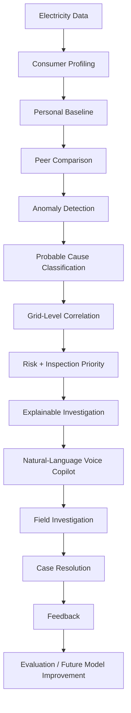

# Product Vision

Electron is a closed-loop grid intelligence platform.

## Target Workflow

## Expected Behavior

Electron should produce investigation support such as:

- consumer risk score
- probable cause
- evidence list
- alternative explanations
- transformer or feeder correlation
- recommended inspection priority

It must not simply output "theft detected."

## Closed Loop

Predictions and field results are stored separately. If the AI predicts theft but the field team confirms meter malfunction, both facts are retained for evaluation.
