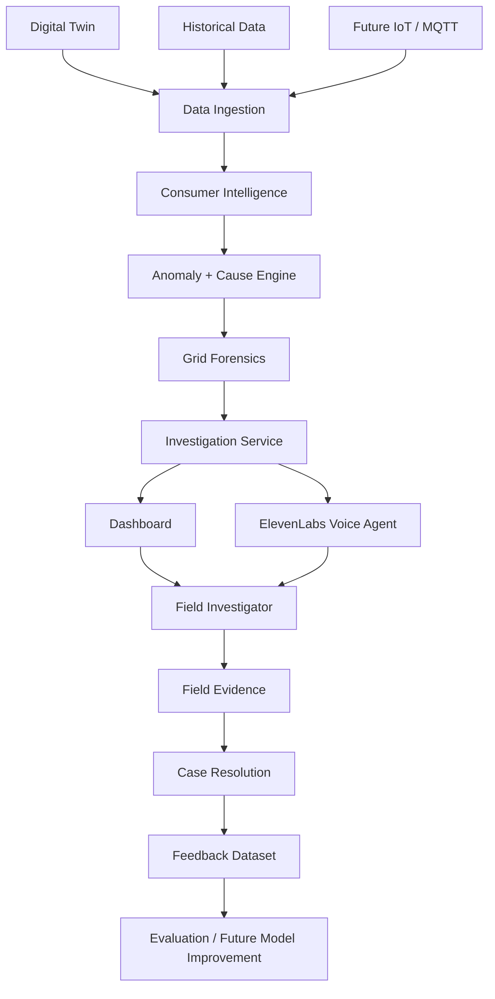
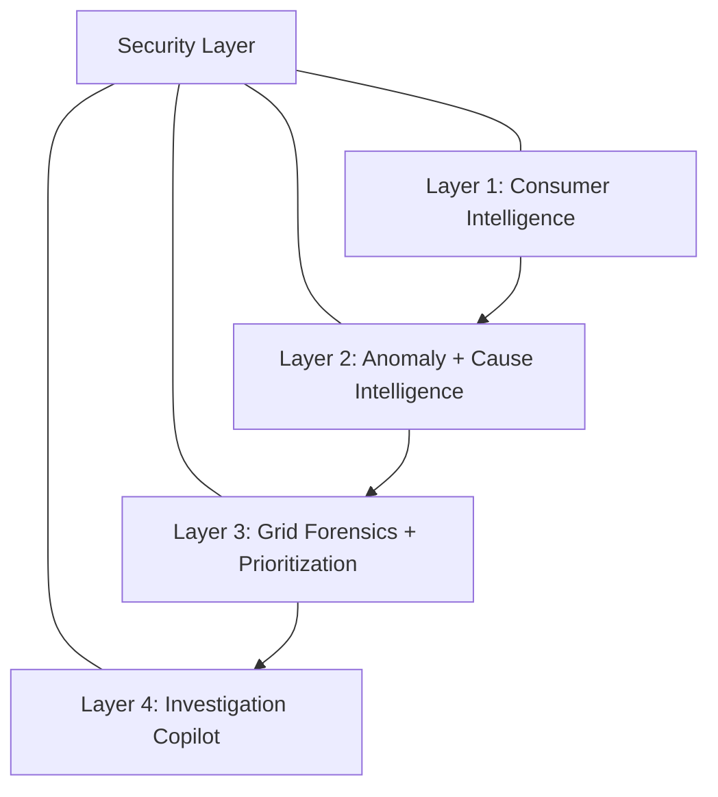
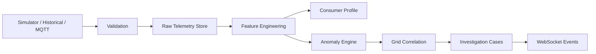

# System Architecture

## Overall Architecture

## Four Intelligence Layers

## Telemetry Pipeline

## Architectural Decisions

- Keep ML/statistical detection separate from LLM explanation.
- Keep ElevenLabs behind controlled backend tool contracts.
- Use PostgreSQL as the system of record.
- Use configurable technical-loss assumptions, not hard-coded percentages.
- Store simulator ground truth separately from predictions.
- Support graceful degradation when OpenAI, ElevenLabs, or ThingsBoard are unavailable.
