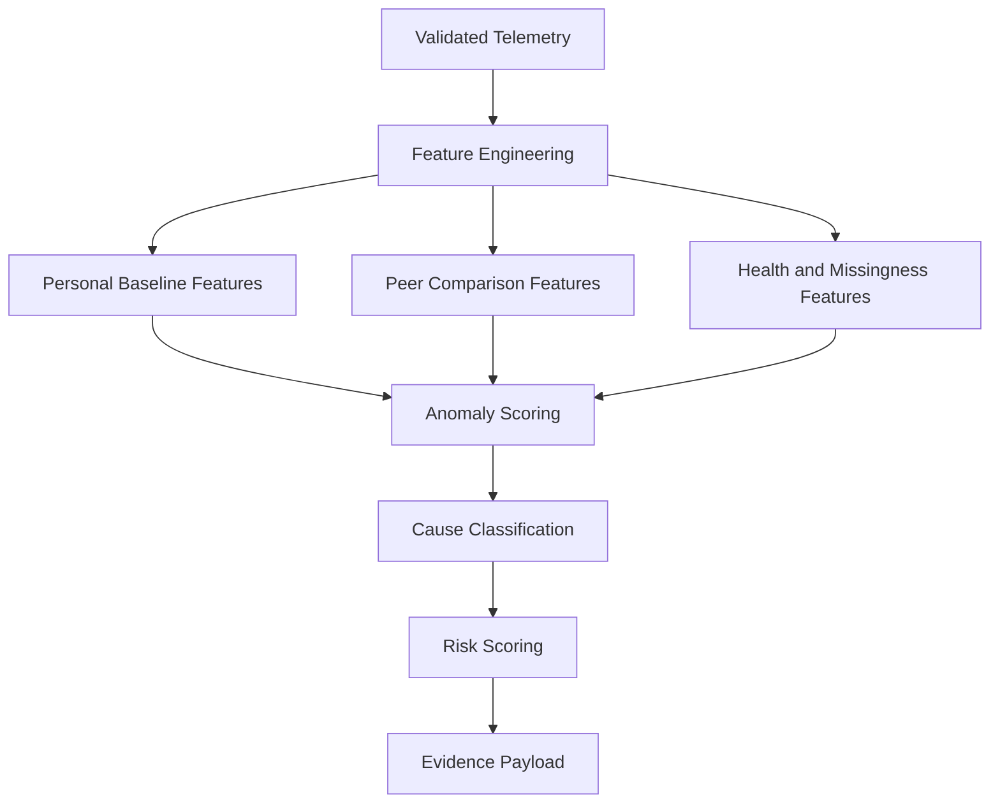

# Anomaly + Cause Engine

Purpose: distinguish abnormal behavior from probable cause.

## Planned Signals

- personal deviation
- peer deviation
- anomaly persistence
- meter health
- communication health
- voltage behavior
- current behavior
- power behavior
- missing readings
- zero readings
- transformer loss correlation
- cluster score

## Planned Classifications

- `NORMAL`
- `THEFT_TAMPERING`
- `METER_MALFUNCTION`
- `COMMUNICATION_FAILURE`
- `LEGITIMATE_ABNORMAL_CONSUMPTION`
- `UNCERTAIN`

## ML Pipeline

## Constraints

- Retain uncertainty.
- Do not equate unusual behavior with theft.
- Do not fabricate model confidence.
- Do not use LLM output as the source of anomaly detection.
