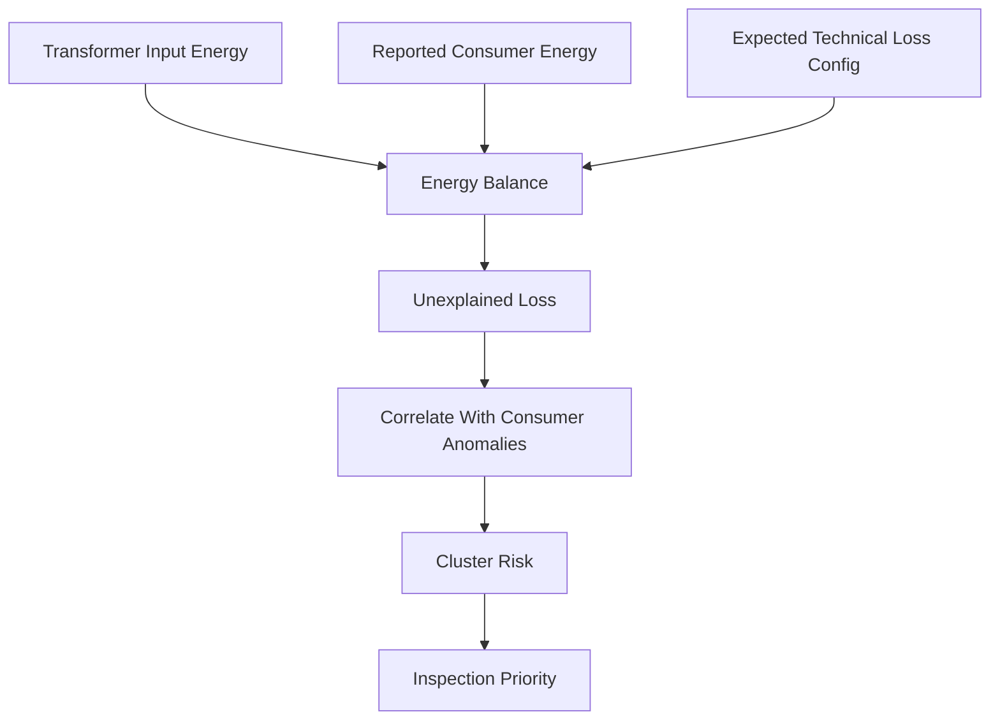

# Grid Forensics + Prioritization

Purpose: correlate consumer anomalies with transformer and feeder energy balance.

## Transformer Forensics Flow



## Key Formula

```text
unexplained_loss =
  transformer_input_energy
  - total_consumer_energy
  - expected_technical_loss
```

Expected technical-loss assumptions must be configurable per transformer, feeder, or policy profile. They must not be hard-coded.

## Outputs

- transformer unexplained loss
- feeder-level loss context
- suspicious consumer clusters
- transformer loss score
- inspection priority inputs
