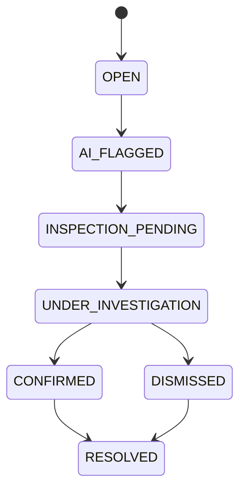
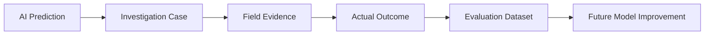

# Investigation Copilot

Purpose: turn machine evidence into field-usable investigation support.

## Responsibilities

- summarize anomaly evidence
- present alternative explanations
- provide inspection checklist
- support field observation capture
- generate case summaries and reports
- preserve uncertainty

## Investigation Lifecycle

## Checklist

- meter physically inspected
- seal inspected
- connected load verified
- meter reading verified
- bypass checked
- physical anomaly observed
- additional notes

## Field Feedback Loop

