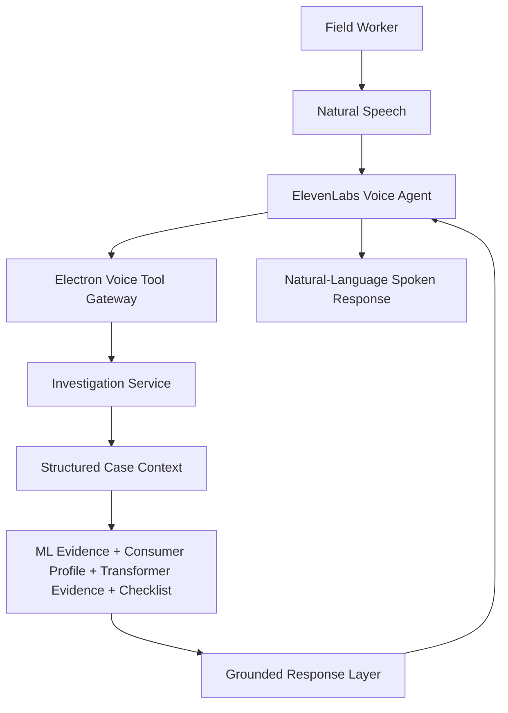

# ElevenLabs Voice Agent Architecture

ElevenLabs is planned as the user-facing conversational and voice interface. It is not the anomaly detector.

## Voice Flow

## Languages

Initial target languages: English, Hindi, Odia. Additional Indian languages should be configurable. The architecture must not assume provider support for every language.

## Tool Boundary

The voice agent must not have direct database access. It may call only narrow backend tools:

- `get_consumer_summary(consumer_id)`
- `get_consumer_baseline(consumer_id)`
- `get_peer_comparison(consumer_id)`
- `get_anomaly_evidence(consumer_id)`
- `get_transformer_summary(transformer_id)`
- `get_investigation_case(case_id)`
- `get_inspection_checklist(case_id)`
- `add_field_observation(case_id, observation)`
- `update_checklist_item(case_id, item_id, status)`
- `request_case_resolution(case_id, resolution)`
- `generate_case_summary(case_id, language)`

See `contracts/voice-agent-tools.schema.json`.

## Grounding Rules

The assistant must not invent:

- meter readings
- consumption values
- risk scores
- transformer losses
- inspection findings
- field evidence
- model confidence

If information is unavailable, it must say so. It should use language such as "probable theft/tampering" or "high-risk anomaly" rather than unsupported accusations.

## Structured Extraction

Voice observations should be converted into proposed structured evidence, then confirmed when consequential:

- "Seal theek hai" -> `seal_status = INTACT`
- "Bypass wire mila" -> `bypass_detected = true`

Case resolution changes should require explicit confirmation.
