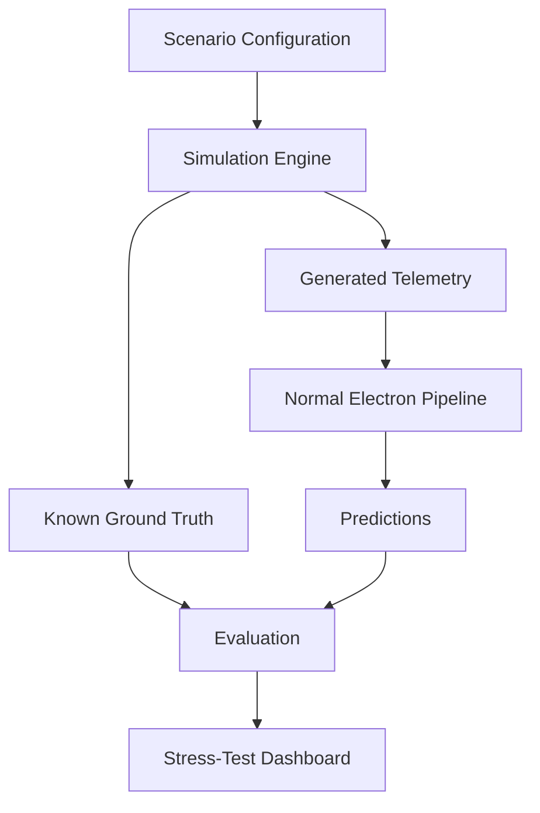

# Digital Twin

The Digital Twin is both a demo environment and an AI testing laboratory.

## Pipeline



## Planned Scenarios

- `NORMAL`
- `THEFT_TAMPERING`
- `METER_MALFUNCTION`
- `COMMUNICATION_FAILURE`
- `SEASONAL_VARIATION`
- `LEGITIMATE_ABNORMAL_CONSUMPTION`
- `COORDINATED_THEFT`

## Digital Twin UX

The planned simulation page shows a hierarchy:

```text
SUBSTATION
  F01
    T01
      consumers...
    T02
      consumers...
  F02
    T03
      consumers...
    T04
      consumers...
```

Consumer node states:

- green: normal
- yellow: suspicious
- red: high risk
- gray: communication unavailable

Controls:

- normal
- inject theft
- meter fault
- communication failure
- seasonal variation
- legitimate reduction
- coordinated theft

The Digital Twin eventually streams telemetry into the same pipeline used for historical and live data.
