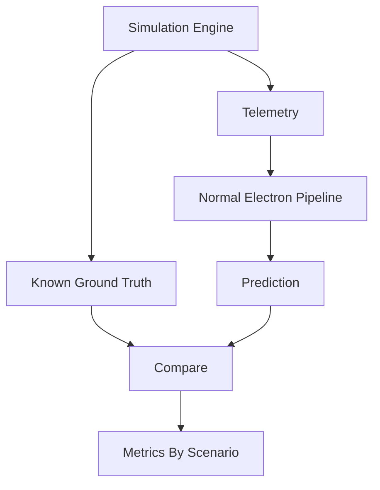

# Testing Strategy

Testing must cover schemas, pipeline behavior, workflows, integrations, and simulation evaluation.

## Stress-Testing Loop

## Planned Metrics

- precision
- recall
- F1
- false-positive rate
- false-negative rate
- detection latency

Metrics must be segmented by scenario:

- `THEFT_TAMPERING`
- `METER_MALFUNCTION`
- `COMMUNICATION_FAILURE`
- `LEGITIMATE_ABNORMAL_CONSUMPTION`

No metrics should be shown until they are computed from actual test runs.

## Test Categories

- schema validation tests
- feature engineering unit tests
- baseline calculation tests
- anomaly scoring tests
- cause classification tests
- transformer accounting tests
- case workflow tests
- voice tool contract tests
- authorization tests
- end-to-end simulation regression tests
