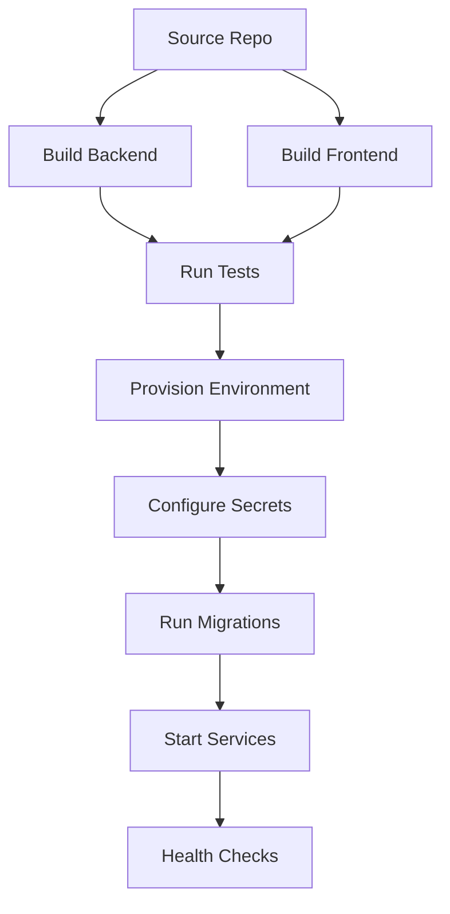

# Deployment Architecture

Deployment is planned but not implemented.

## Target Components

- Next.js frontend
- FastAPI backend
- PostgreSQL database
- optional MQTT broker
- optional ThingsBoard
- optional ElevenLabs integration
- optional OpenAI-backed report generation

## Deployment Flow

## Environments

- local hackathon demo
- staging
- production

## Graceful Degradation

Core detection should work without OpenAI, ElevenLabs, or ThingsBoard. Those systems enhance explanation, voice interaction, and IoT visualization but must not be hard dependencies for anomaly detection.
